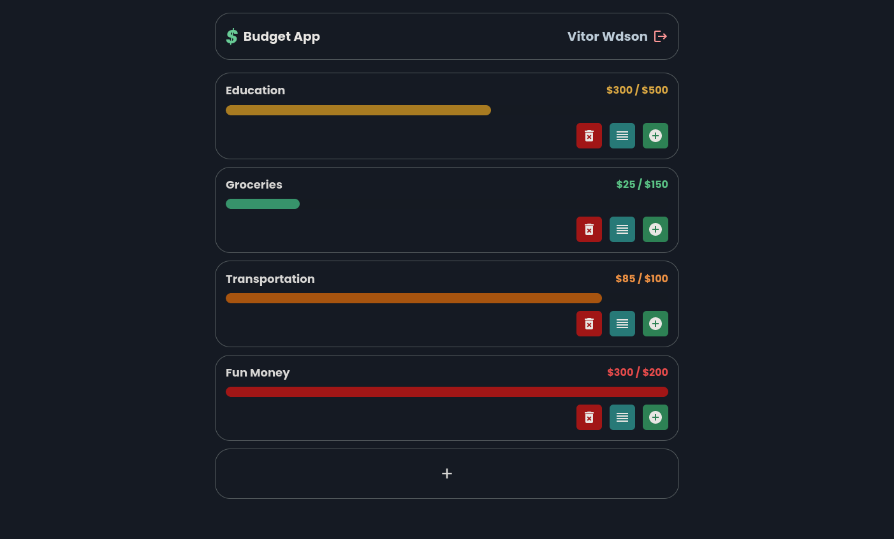

# Budget App

> This project is a simple app where you can manage your budgets and expenses.

## How to access

You can access the app using [this link](https://budget-app.vitorwdson.me/).  
Note: In case you don't want to create a new account to test the app, you can login with the test account:

- Email: `test@email.com`
- Password: `Test@123`

## Powered By

- ReactJS
- URQL
- MongoDB
- NestJS
- Apollo GraphQL

## TODO

- [x] Authentication
- [x] Budget Management
- [x] Cache Normalization
- [ ] Color Theme Switcher
- [ ] Change Password Page
